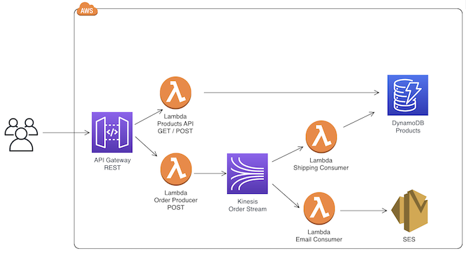

# Real-Time Streaming Application with AWS Kinesis

## Overview

This project aims to build a real-time streaming application using Amazon Kinesis data stream. The application consists of a React front-end deployed to an S3 bucket, a REST API exposed via API Gateway, Lambda functions for processing products and orders, and a DynamoDB database for data persistence. The application workflow involves capturing input data, processing it in real-time, and utilizing the data for various purposes.

## Architecture

The architecture consists of the following components:

- React Application deployed to an S3 bucket
- REST API exposed via API Gateway
- Lambda functions:
  - Product processing
  - Order processing
  - Email confirmation
  - Shipping updates
- DynamoDB for data storage
- Amazon Kinesis Data Stream for real-time data ingestion and processing
- Amazon SES for sending email confirmations

## React Application

The React application provides a user interface for interacting with the backend services. It collects partial shipping information and allows users to select products for purchase. Key components include:

- Home page component for product selection
- Interaction with API endpoints for data retrieval and order processing

## Backend Services

### Lambda Functions

1. **Product API Lambda Function**: Handles product-related operations such as listing products and adding new products to the database.
2. **Order Producer Lambda Function**: Streams order data to the Kinesis data stream for further processing.
3. **Email Consumer Lambda Function**: Sends order confirmation emails to customers using SES.
4. **Shipping Consumer Lambda Function**: Updates inventory quantity in DynamoDB based on order processing.

### DynamoDB

- DynamoDB is used as the database for storing product information and order data.

### Amazon Kinesis Data Stream

- Kinesis Data Stream facilitates real-time data ingestion and processing. It streams order data from the producer to consumer Lambda functions.

### Amazon SES

- SES is utilized for sending order confirmation emails to customers.

## Implementation

1. **Setting Up IAM Roles**: IAM roles are created with appropriate policies for Lambda functions to interact with CloudWatch, DynamoDB, Kinesis, and SES.
2. **DynamoDB**: The database table is created with necessary attributes.
3. **SES Identity Verification**: Email addresses are verified for sending and receiving emails via SES.
4. **Kinesis Data Stream**: A data stream is created with the required shard capacity.
5. **Lambda Functions**: Lambda functions are created for various purposes and deployed with necessary code.
6. **API Gateway**: REST APIs are created to expose Lambda functions as endpoints for interaction with the React application.
7. **React Application Deployment**: The React application is built and deployed to an S3 bucket for hosting.
8. **Testing and Monitoring**: Postman is used for testing API endpoints, and CloudWatch is utilized for monitoring Lambda function logs.

## Conclusion

This project demonstrates the implementation of a real-time streaming application using AWS services. It showcases how to build scalable and resilient systems for processing and analyzing data in real-time.

---
